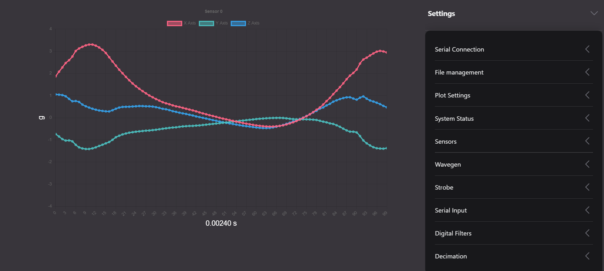
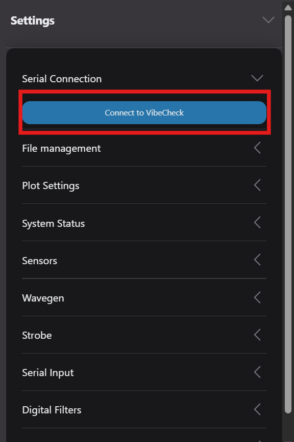
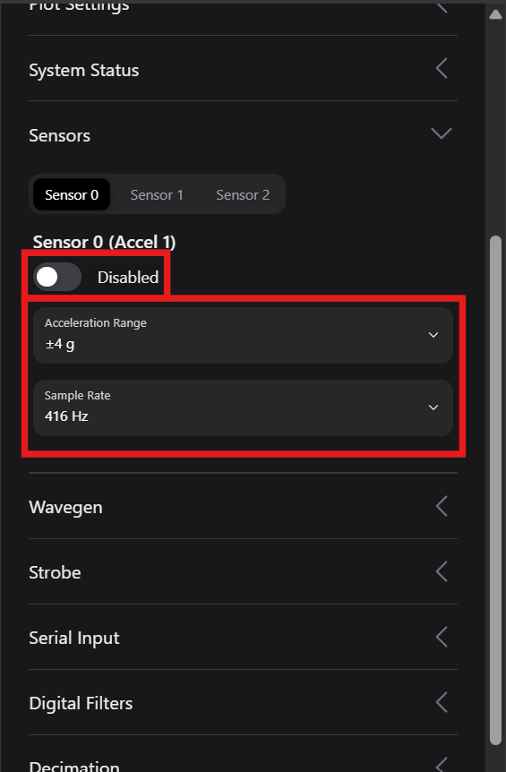
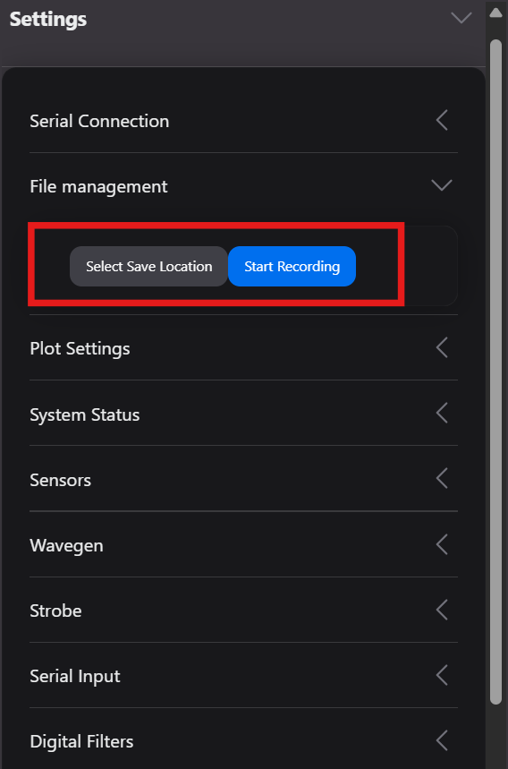
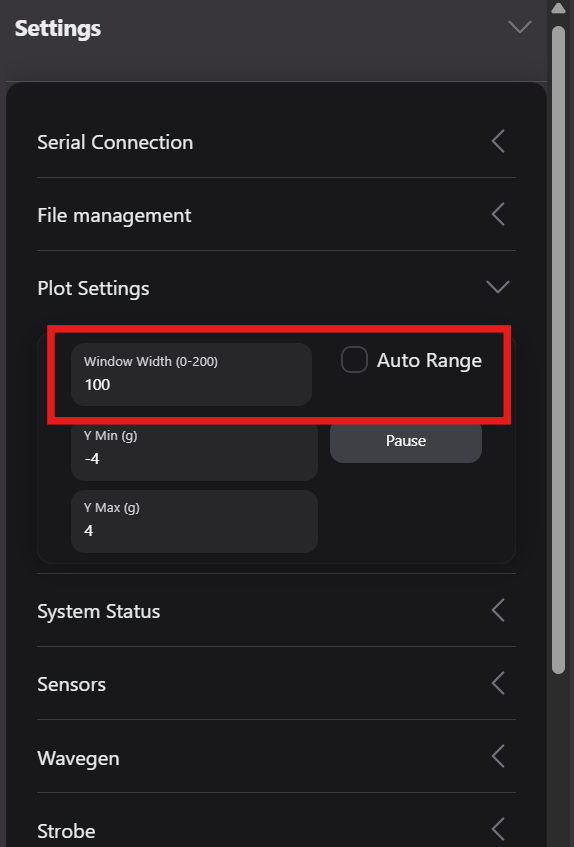
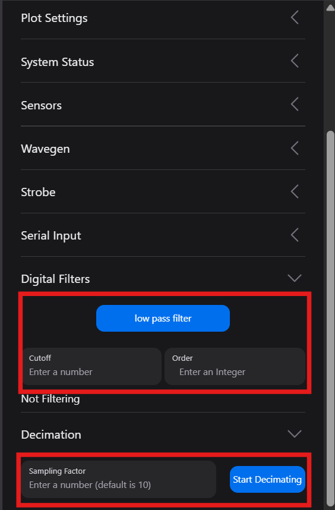
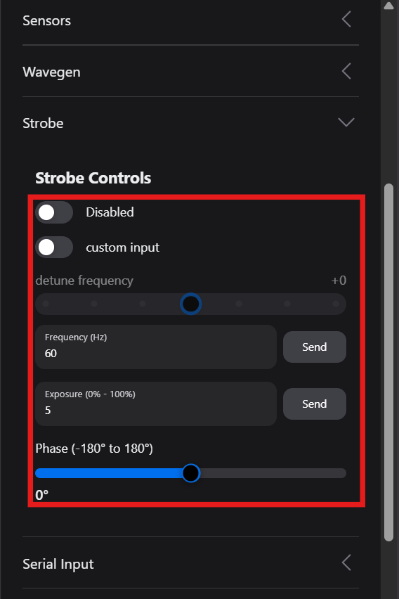
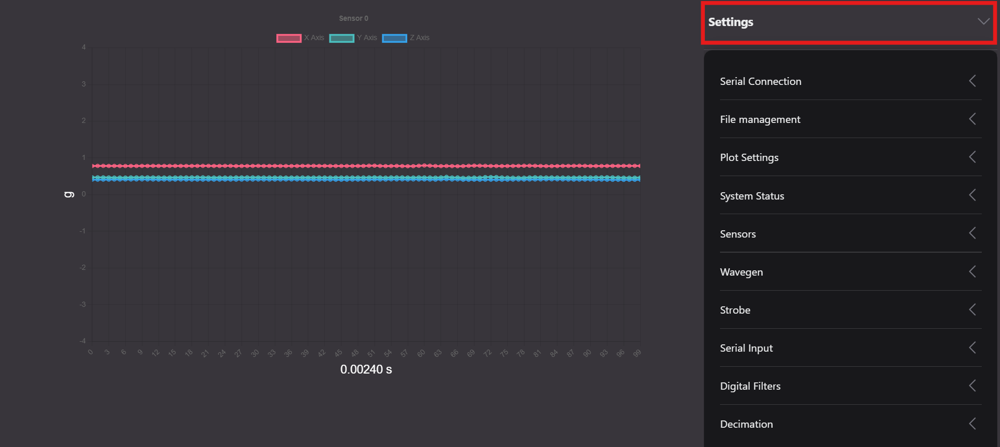

# Welcome to the VibeCheck Web Application

This application is meant to serve most usecases that students are likely to have when using the VibeCheck sensor system for vibration measurement and data visualization. It is built using modern web front end frameworks.

<p align="center">
  
</p>


## Connect your VibeCheck hardware:
[Try the site for yourself!](https://harrislab-brown.github.io/VibeCheck_Web/)

## Browser Compatability
The VibeCheck_Web relies on the WebSerial API for communication with hardware devices. It's important to note that the WebSerial API is not supported by all browsers. Here's a detailed compatibility breakdown:

## Compatible Browsers

- Google Chrome: Version 89 or later
- Microsoft Edge: Version 89 or later (Chromium-based Edge)
- Opera: Version 76 or later

## Incompatible Browsers

- Mozilla Firefox: No support (as of August 2025)
- Safari: No support (as of August 2025)
- Internet Explorer: No support

## Mobile Browsers

The WebSerial API is primarily designed for desktop use. As of August 2025:

- No mobile browsers officially support the WebSerial API
- Chrome for Android may have experimental support, but it's not reliable for production use

## Notes on Compatibility

1. **Chrome OS**: Fully supports the WebSerial API.

2. **Linux**: Support can vary depending on the system configuration. Users may need to add themselves to the `dialout` group or adjust udev rules to access serial ports.

3. **Windows**: Requires no additional setup for most users.

4. **macOS**: Users may need to install drivers for certain USB-to-Serial adapters.


## Checking for Browser Support

VibeCheck_Web checks for browser compatibility on startup. If your browser is compatible, the system status message will reflect this and the 'connect' button will be selectable. Clicking it will open a dialog box to select a serial port from the available options. If your VibeCheck hardware is connected, it will appear as a device called 'VibeCheck.' If your browser is not compatible, the system status message will give a compatibility error and the connect button will be grayed out.

To check compatibility without the VibeCheck_Web app, you can use the following JavaScript code to check if the current browser supports the WebSerial API:

```javascript
if ('serial' in navigator) {
  console.log('This browser supports WebSerial');
} else {
  console.log('This browser does not support WebSerial');
}
```
# User Guide

### Connecting To VibeCheck Hardware

- Connect your VibeCheck to a computer with a USB-C cable
- Use the light blue Connect button under Serial Connection to open a serial port
<p align="center">
  
</p>

- Attach a sensor board to your VibeCheck with a JST cable
- Enable a sensor from the Sensors dropdown 
- Set the desired measurement range and sample rate
<p align="center">
  
</p>

### Saving your data to a local csv file

- Select a folder to save data using the Select Save Location button in the File Management 
- Begin saving data using the Start Recording button
- What you see on the graph is what is saved
- After saving a large amount of data you may need to wait a moment for your file to be ready

<p align="center">
  
</p>

### Control your plot

- Window width controls the number of datapoints shown on the screen (Max 1000)
- Use auto range for the graph height to fill the space, or set manual bounds
- Click on the colorful boxes above the graph to turn on/off that portion of the graph
<p align="center">
  
</p>

### Processing your data

- Turn on a lowpass filter under digital filters, the default has a cutoff frequency of 200 Hz
- Change the cutoff frequency with the input box
- Turn on decimation to sample the data (automatically turns on the filter to avoid aliasing)
- Turn down the order (quality) of the filter with the order input box (only recommended if the filter is causing a large delay)

<p align="center">
  
</p>

### Sending Serial Commands

- You can send serial commands to the VibeCheck Hardware using the serial input box

### Using the Wavegen feature of the VibeCheck Hardware

- Plug an amplifier into a speaker
- Plug a headphone cable from the VibeCheck's port to the amplifier
- Turn on the waveForm geneterator under Wavegen
- Choose the Shape of your wave
- Choose desired Frequency and Amplitude of your wave
- Adjust the amplifier's volume to control the wave being generated

<p align="center">
  
</p>

### Using the Strobe feature of the VibeCheck Hardware

- Place the VibeCheck near the speaker
- Turn on Strobe Controls
- Choose custom frequency or set set a constent offset from the wavegen frequency 
- Choose desired exposure and phase offset

<p align="center">
  
</p>

### Tips

- Click the big settings title to collapse the settings bar and let the graph fill your screen
<p align="center">
  
</p>

- Important messages such as browser compatabilty upon startup will be in system status
- Always press Enter after typing in an input box
- Set wavegen and strobe frequency to the same value and mess with the phase slider


# Developer Guide

This app is based on Vite + React + Redux. The folder heirarchy for this project is meant to be descriptive of the function of each file that makes up the app.

```

vibecheck_web/
├── src/
│   ├── components/
│   │   ├── ChartComponent.tsx
│   │   ├── ChartContainer.tsx
│   │   ├── FileContainer.tsx
│   │   ├── FilterComponent.tsx
│   │   ├── Layout.tsx
│   │   ├── Logo.tsx
│   │   ├── PlotControlsComponent.tsx
│   │   ├── SensorSettingsComponent.tsx
│   │   ├── SerialConnect.tsx
│   │   ├── SerialInput.tsx
│   │   ├── SettingsAccordion.tsx
│   │   ├── StrobeComponent.tsx
│   │   └── SystemStatus.tsx
│   │   ├── WavegenComponent.tsx
│   ├── features/
│   │   ├── dataSlice.ts
│   │   ├── fileSlice.ts
│   │   ├── plotSlice.ts
│   │   ├── sensorSlice.ts
│   │   ├── serialOutputSlice.ts
│   │   ├── serialSlice.ts
│   │   ├── strobeSlice.ts
│   │   ├── systemStatusSlice.ts
│   │   └── wavegenSlice.ts
│   ├── hooks/
│   │   ├── useSensor.ts
│   │   ├── useStrobe.ts
│   │   └── useWavegen.ts
│   ├── middleware/
│   │   └── serialOutputMiddleware.ts
│   ├── public/
│   │   ├── VibeCheck_logo.png
│   │   ├── VibeCheck_Web_example.png
│   ├── redux/
│   │   ├── hooks.ts
│   │   ├── rootReducer.ts
│   │   └── store.ts
│   ├── services/
│   │   ├──DataProcessingService.ts
│   │   ├── FileStreamService.ts
│   │   └── SerialService.ts
│   ├── styles/
│   │   ├── Chart.css
│   │   ├── ChartContainer.css
│   │   ├── index.css
│   │   ├── Layout.css
│   │   ├── Logo.css
│   │   ├── PlotControls
│   │   ├── SerialConnect.css
│   │   └── SystemStatus.css
│   ├── types/
│   │   └── index.ts
│   ├── utils/
│   │   ├── appInitialization.ts
│   │   └── dataParser.ts
│   ├── App.tsx
│   ├── main.tsx
│   └── vite-env.d.ts
├── tsconfig.json
├── README.md
└── index.html
```


## Installation Guide

This guide will walk you through the process of setting up and running the VibeCheck app on your local development environment.

### Prerequisites

Before you begin, ensure you have the following installed on your system:

- Node.js (v14.0.0 or later)
- npm (v6.0.0 or later) or Yarn (v1.22.0 or later)
- Git

### Step 1: Clone the Repository

First, clone the VibeCheck repository to your local machine:

```bash
git clone https://github.com/harrislab-brown/VibeCheck.git
cd VibeCheck_Web
```

### Step 2: Install Dependencies

Install the project dependencies using npm or Yarn:

```bash
# If using npm
npm install

# If using Yarn
yarn install
```

### Step 3: Configure the Environment

If there are any environment-specific configurations, create a `.env` file in the root directory of the project and add the necessary variables. For example:

```
VITE_API_URL=http://localhost:3000
```

### Step 4: Run the Development Server

Start the development server:

```bash
# If using npm
npm run dev

# If using Yarn
yarn dev
```

This will start the Vite development server. The console will display the URL where you can access the app, typically `http://localhost:5173`.

### Step 5: Accessing the App

Open your web browser and navigate to `http://localhost:5173` (or the URL provided in the console). You should now see the VibeCheck app running.

### Additional Commands

- To build the app for production:
  ```bash
  npm run build
  # or
  yarn build
  ```

### Troubleshooting

- If you encounter any issues with dependencies, try deleting the `node_modules` folder and the `package-lock.json` (or `yarn.lock`) file, then run the installation step again.
- Ensure you're using a compatible version of Node.js as specified in the `package.json` file.
- For any WebSerial API related issues, make sure you're using a compatible browser (Chrome, Edge, or Opera) and that your system supports WebSerial.

### Development Notes

- This app uses React with TypeScript and Vite as the build tool.
- State management is handled by Redux Toolkit.
- The app communicates with the VibeCheck hardware using the WebSerial API.

If you encounter any issues or have questions, please refer to the project's issue tracker on GitHub or contact the development team.
